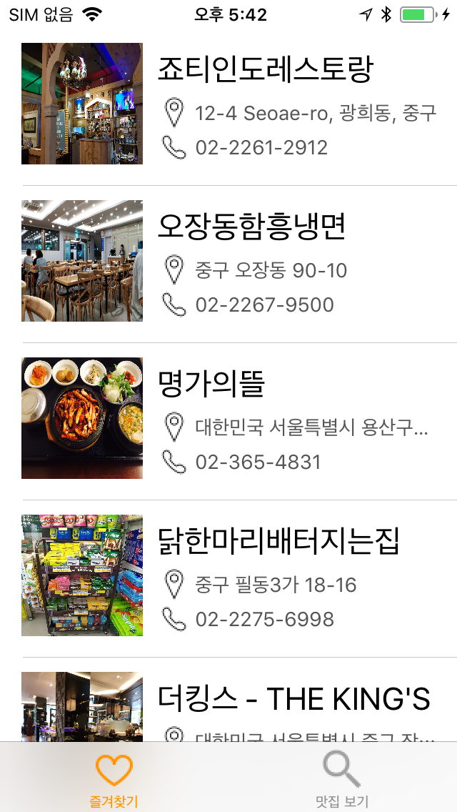

# MatJip GO #

  
  
  

## Description ##

Find restaurants through Augmented Reality!

You can register favorite restaurants and see reviews about the restaurant.

증강현실을 이용하여 맛집을 찾아보세요!

좋아하는 맛집을 즐겨찾기에 등록하고 맛집 리뷰를 볼 수 있습니다.

\#AR \#Hole in the wall \#Restaurant \#Review

## To-Do ##
- [x] Server
- [x] API
- [x] AR

## Developer ##

* [김성수](https://github.com/munak)
* [한효병](https://github.com/hanhb1011)
* [이기혁](https://github.com/rascal1101)
